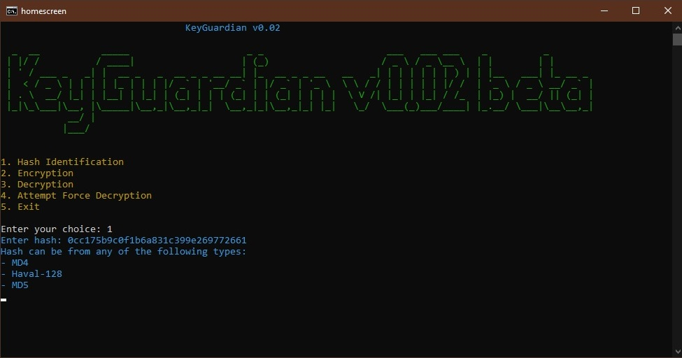

KeyGuardian - README

KeyGuardian
===========

KeyGuardian is a powerful C++ tool designed for data encryption, decryption, hash identification, and brute-force decryption. This versatile tool is aimed at providing developers and security enthusiasts with a reliable solution for securing and managing sensitive information.

Features
--------

*   Data Encryption: Securely encrypt your sensitive data using advanced encryption algorithms.
*   Data Decryption: Decrypt encrypted data using the appropriate key.
*   Hash Identification: Identify the hash type of provided hashes.
*   Brute Force Decryption: Attempt to decrypt data using a brute force approach.
*   User-Friendly Interface: A user-friendly command-line interface for easy interaction.

Usage
-----

1.  Clone the repository:
`git clone https://github.com/yourusername/KeyGuardian.git`
`cd KeyGuardian`
2.  Build the project:
`g++ -o keyguardian main.cpp`
3.  Run KeyGuardian:
`./keyguardian`

For detailed usage instructions and examples, please refer to the [documentation](docs/README.md).

Contributors
------------

A big thank you to the following contributors who have helped shape and improve KeyGuardian:

1.  [Contributor 1](https://github.com/brodante)  
    \- Role: Developer  |  Security Expert
    \- Contributions: Encryption algorithms, user interface enhancements. Brute force decryption module, hash identification.
2.  [Contributor 3](https://github.com/pdd1825)  
    \- Role: Documentation Lead  
    \- Contributions: Comprehensive documentation, usage examples.
3.  [Contributor 4](https://github.com/rishabhpandey106)  
    \- Role: Tester  
    \- Contributions: Extensive testing, bug fixes.
4.  [Contributor 5](https://github.com/SpartanXY)  
    \- Role: UI/UX Designer  
    \- Contributions: CLI design, logo creation.

License
-------

This project is licensed under the [MIT License](LICENSE).

Acknowledgements
----------------

KeyGuardian was inspired by the need for a reliable encryption tool to enhance data security. We appreciate the open-source community for providing various libraries and resources that have contributed to the development of this project.

* * *

Feel free to contribute to KeyGuardian by submitting issues, feature requests, or pull requests. Your contributions are valuable and help make the tool even better!
